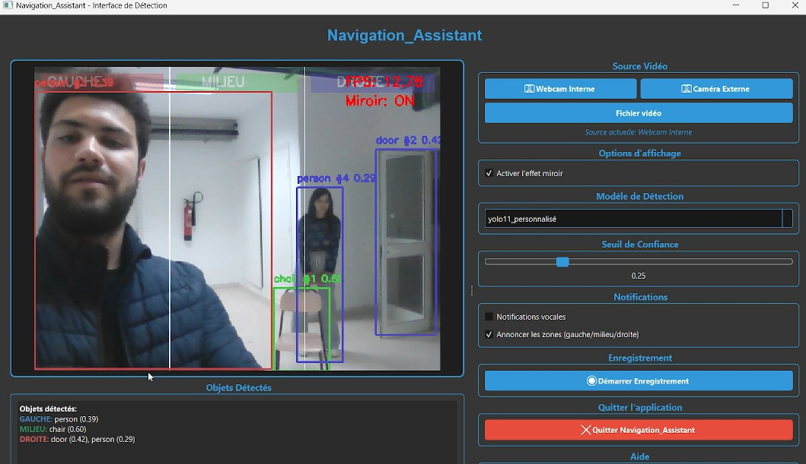

# Navigation Assistant for the Blind

A real-time object detection and navigation assistant application designed to help visually impaired individuals navigate their environment safely. The system uses YOLO models to detect objects and provides voice feedback about their location.

## Features

- **Real-time Object Detection**: Uses YOLOv8/v11 models for accurate object detection
- **Multi-Source Support**: Works with internal webcam, external camera, or video files
- **Spatial Awareness**: Divides the screen into three zones (left, center, right) to indicate object positions
- **Voice Notifications**: Provides audio feedback about detected objects and their locations
- **Object Tracking**: Implements ByteTrack for persistent object tracking across frames
- **Video Recording**: Ability to record detection sessions with annotations
- **Customizable Settings**: Adjustable confidence threshold and model selection
- **Modern GUI**: Built with PyQt6 for an intuitive user interface

## Screenshots


*Main interface showing real-time detection and controls*

## Requirements

- Python 3.8+
- OpenCV
- PyQt6
- PyTorch
- Ultralytics YOLO
- pyttsx3
- NumPy

## Installation

1. Clone the repository:
```bash
git clone https://github.com/yourusername/navigation-assistant.git
cd navigation-assistant
```

2. Create a virtual environment (recommended):
```bash
python -m venv venv
source venv/bin/activate  # On Windows: venv\Scripts\activate
```

3. Install required packages:
```bash
pip install -r requirements.txt
```

4. Download YOLO models:
The application will automatically download YOLOv8n on first run. For additional models:
- Place `yolo11n.pt` in the project root for YOLOv11
- Place `best8.pt` and `best11.pt` for custom trained models (optional)

## Usage

Run the application:
```bash
python navigation_assistant.py
```

### Quick Start Guide

1. **Select Video Source**: Choose between internal webcam, external camera, or video file
2. **Choose Detection Model**: Select from available YOLO models in the dropdown
3. **Adjust Confidence Threshold**: Use the slider to set detection sensitivity (default: 0.25)
4. **Enable Voice Notifications**: Check the box to receive audio feedback
5. **Enable Zone Announcements**: Get directional information (left/center/right)
6. **Mirror Effect**: Toggle mirror mode for more natural webcam viewing

### Recording Sessions

1. Click "Démarrer Enregistrement" to start recording
2. The system saves annotated video with detections
3. Click "Arrêter Enregistrement" to stop and save
4. Recordings are saved in `~/Navigation_Assistant_Recordings/`

## Project Structure

```
navigation-assistant/
│
├── navigation_assistant.py    # Main application file
├── requirements.txt           # Python dependencies
├── README.md                 # This file
├── LICENSE                   # License information
├── .gitignore               # Git ignore rules
│
├── models/                  # YOLO model files (not tracked)
│   ├── yolov8n.pt
│   ├── yolo11n.pt
│   ├── best8.pt
│   └── best11.pt
│
├── screenshots/             # Application screenshots
│   └── interface.png
│
└── docs/                    # Additional documentation
    └── user_guide.md
```

## Configuration

### YOLO Models

The application supports multiple YOLO models:
- **yolov8n**: Lightweight YOLOv8 nano model (default)
- **yolo11n**: YOLOv11 nano model (if available)
- **yolo8_personnalisé**: Custom trained YOLOv8 model
- **yolo11_personnalisé**: Custom trained YOLOv11 model

### Custom Model Training

To use your own trained models:
1. Train your model using Ultralytics YOLO
2. Save the trained weights as `best8.pt` or `best11.pt`
3. Place the files in the project root directory
4. Select the custom model from the dropdown

## Customization

### Adjusting Detection Zones

Edit the zone boundaries in the `VideoThread.improved_run_with_tracking()` method:
```python
left_boundary = width // 3      # Left zone boundary
right_boundary = 2 * width // 3  # Right zone boundary
```

### Voice Settings

Modify TTS engine settings in the `TTSThread` class initialization:
```python
self.engine = pyttsx3.init()
# Customize voice properties
self.engine.setProperty('rate', 150)    # Speed
self.engine.setProperty('volume', 0.9)  # Volume
```

## Known Issues

- Camera switching may require restarting the application on some systems
- External camera index may vary depending on system configuration
- TTS voices depend on system-installed speech engines

## Contributing

Contributions are welcome! Please feel free to submit a Pull Request. For major changes:

1. Fork the repository
2. Create your feature branch (`git checkout -b feature/AmazingFeature`)
3. Commit your changes (`git commit -m 'Add some AmazingFeature'`)
4. Push to the branch (`git push origin feature/AmazingFeature`)
5. Open a Pull Request

## Future Enhancements

- [ ] Add support for depth estimation
- [ ] Implement obstacle distance measurement
- [ ] Add multi-language support
- [ ] Mobile app version
- [ ] Cloud-based model updates
- [ ] GPS integration for outdoor navigation
- [ ] Haptic feedback support

## License

This project is licensed under the MIT License - see the [LICENSE](LICENSE) file for details.

## Acknowledgments

- [Ultralytics YOLO](https://github.com/ultralytics/ultralytics) for the object detection models
- [PyQt6](https://www.riverbankcomputing.com/software/pyqt/) for the GUI framework
- [ByteTrack](https://github.com/ifzhang/ByteTrack) for object tracking
- OpenCV community for computer vision tools

## Contact

Your Name - [@yourtwitter](https://twitter.com/yourtwitter) - email@example.com

Project Link: [https://github.com/yourusername/navigation-assistant](https://github.com/yourusername/navigation-assistant)

## Support

If you find this project helpful, please consider giving it a ⭐ on GitHub!

---

**Note**: This application is designed as an assistive tool and should not replace traditional mobility aids or professional orientation and mobility training.